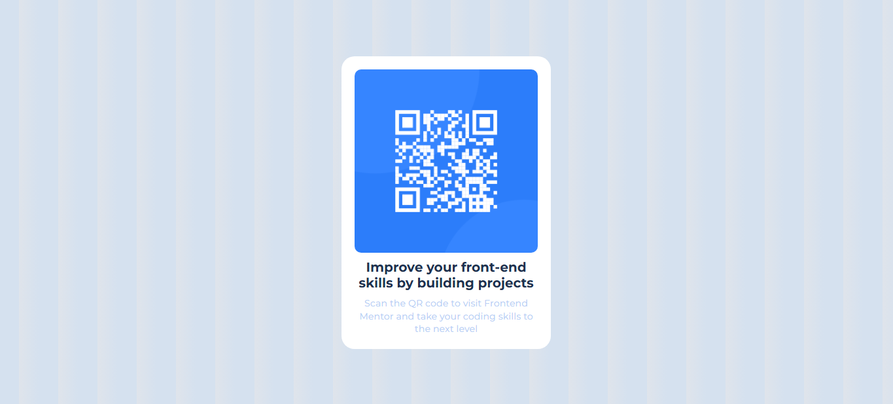

# Frontend Mentor - QR code component solution

This is a solution to the [QR code component challenge on Frontend Mentor](https://www.frontendmentor.io/challenges/qr-code-component-iux_sIO_H). Frontend Mentor challenges help you improve your coding skills by building realistic projects. 

## Table of contents

- [Overview](#overview)
  - [Screenshot](#screenshot)
  - [Links](#links)
  - [Built with](#built-with)
  - [What I learned](#what-i-learned)
  - [Continued development](#continued-development)
  - [Useful resources](#useful-resources)
  - [AI Collaboration](#ai-collaboration)
- [Author](#author)

## Overview

The challenge was to design a qr-component and make it look like the design provided as close as possible. It really enforces some of your css skills and html semantics.

### Screenshot




### Links

- Solution URL: [Solution url](https://github.com/dAvvMaster/qr-component.git))
- Live Site URL: ([Live url](https://davvmaster.github.io/qr-component/))

### Built with

- Semantic HTML5 markup
- CSS custom properties
- Flexbox

### What I learned

I have learned so much than i expected to in this project. The first thing that i learned was centering the qr-box using flex-box required me to put it in another div container and the div container was the one I needed to center first. It took me alot of time to figure that one out sadly but I was really glad to be able to have that knowledge. Another thing that I learned was how to import a font from google fonts, the font that I imported was 'Montserrat' because I felt like that was the one which was really close to the example design.


```html
<link href="https://fonts.googleapis.com/css2?family=Montserrat:wght@400;700&display=swap" rel="stylesheet">
```
```css
.qr-container{
   flex: 1;
   display: flex;
   align-items: center;
   justify-content: center;
}
```

### Continued development

As i progrss in my front-end journey my next focus is JavaScript as I have just started and using css grid, mastering flexbox and even animations in both css and JavaScript

### Useful resources

- [Example resource ](https://fonts.google.com/) - This helped me for finding a great font for my project. I really liked this pattern and will use it going forward.

### AI Collaboration

I was not really heavy on AI but I used co-pilot for brainstorming some of the ideas I had, that really assisted me to learn and I am going to use it in my upcoming projects.


## Author

- Frontend Mentor - [Davis Osebe](https://www.frontendmentor.io/profile/Davis Osebe)
- Twitter - [@davv_cyber](https://www.twitter.com/@davv_cyber)

